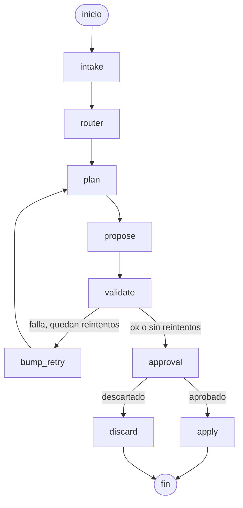

# Portfolio Orchestrator

Sistema multiagente construido sobre **LangGraph** que edita mi portafolio profesional ([portfolio-web](../portfolio-web)) de forma autónoma pero supervisada: recibe una instrucción en lenguaje natural, la clasifica, genera una propuesta de cambio, la valida y la deja pendiente de aprobación humana antes de tocar el proyecto real.

Ningún cambio llega al portafolio sin pasar por un workspace aislado, una validación determinista y una aprobación explícita.

---

## Índice

- [Cómo funciona](#cómo-funciona)
- [Características](#características)
- [Arquitectura](#arquitectura)
- [Estructura del proyecto](#estructura-del-proyecto)
- [Requisitos](#requisitos)
- [Instalación](#instalación)
- [Uso](#uso)
- [Configuración](#configuración)
- [Estado del proyecto](#estado-del-proyecto)
- [Licencia](#licencia)

---

## Cómo funciona

1. **Intake** — se recibe la instrucción del usuario (chat) y se genera un `run_id` por conversación.
2. **Router** — clasifica la instrucción en `content`, `ui` o `architecture`, con una complejidad asociada (`low`/`medium`/`high`). Usa reglas por expresiones regulares y solo recurre a un LLM (20B) como red de seguridad cuando ninguna regla coincide.
3. **Plan** — decide el modelo (tier) a usar según el tipo de tarea, la complejidad y los reintentos previos.
4. **Propose** — el subagente correspondiente (contenido o frontend) genera la propuesta de cambio y la escribe en un **workspace aislado**, nunca en el proyecto real.
5. **Validate** — corren validaciones deterministas (JSON válido, estructura esperada, etc.) sin usar ningún LLM.
6. **Retry / Escalate** — si la validación falla y quedan reintentos disponibles, se reintenta escalando de modelo automáticamente.
7. **Approval** — se pausa la ejecución (`interrupt()`) y se muestra el diff al usuario para que apruebe o descarte el cambio.
8. **Apply / Discard** — si se aprueba, el cambio se copia al portafolio real; si se descarta, el workspace se elimina sin dejar rastro.



---

## Características

- **Router determinista con fallback a LLM.** Reglas por regex primero; un modelo pequeño (20B) clasifica solo cuando hace falta, para minimizar costo y latencia.
- **Escalamiento por tiers.** Las tareas simples se resuelven con modelos económicos (Groq `gpt-oss-20b` / `gpt-oss-120b`); las de arquitectura, alta complejidad o con fallos repetidos escalan automáticamente a `claude-sonnet-4-5`.
- **Workspace aislado.** Cada propuesta se escribe en `.workspaces/<run_id>/`, fuera del proyecto real. El proyecto principal nunca se modifica hasta la aprobación.
- **Human-in-the-loop.** El grafo se pausa con `interrupt()` y expone un diff unificado + botones de aprobación, compatible con Agent Chat UI y LangGraph Studio.
- **Validación determinista.** Antes de pedir aprobación se verifica que el JSON sea válido y conserve su estructura, sin depender de un LLM para juzgar corrección.
- **Persistencia entre sesiones.** Checkpointer en SQLite: una conversación interrumpida puede resumirse más tarde exactamente donde quedó.
- **Convenciones inyectadas al prompt.** [`AGENTS.md`](AGENTS.md) y las skills en [`skills/`](skills/) se cargan como contexto de sistema para que cada subagente respete el tono, la estructura de datos y los principios de diseño del portafolio.

---

## Arquitectura

El sistema está organizado en tres capas:

| Capa | Responsabilidad | Ubicación |
|---|---|---|
| **Orquestación** | Define el grafo de estados y el flujo de control | [`graph.py`](graph.py), [`state.py`](state.py) |
| **Agentes** | Clasifican, planifican y generan propuestas de cambio | [`agents/`](agents/) |
| **Herramientas** | Workspace aislado, diffing, validaciones y acceso al LLM | [`tools/`](tools/), [`core/`](core/) |

### Modelos por tier

| Tier | Proveedor | Modelo | Cuándo se usa |
|---|---|---|---|
| `easy` | Groq | `openai/gpt-oss-20b` | Tareas de complejidad baja (copy, textos breves) |
| `medium` | Groq | `openai/gpt-oss-120b` | Tareas normales de contenido o UI |
| `hard` | Anthropic | `claude-sonnet-4-5` | Arquitectura, complejidad alta o reintentos agotados |

### Agentes especializados

| Agente | Edita | Archivo |
|---|---|---|
| `content` | Contenido del portafolio (`site.json`), usando datos reales de `data/profile.json` | [`agents/content.py`](agents/content.py) |
| `frontend` | Componentes y páginas de la interfaz (`app/page.tsx`) | [`agents/frontend.py`](agents/frontend.py) |

Este repositorio orquesta el proyecto **portfolio-web** (Next.js + TypeScript + Tailwind CSS), ubicado como carpeta hermana en el sistema de archivos. `portfolio-orchestrator` nunca clona ni copia ese proyecto: lee y escribe directamente sobre él a través del workspace aislado.

---

## Estructura del proyecto

```text
portfolio-orchestrator/
├── agents/              # Subagentes: router, planner, content, frontend
├── core/                # Cliente LLM (Groq / Anthropic) por tier
├── data/                # profile.json — datos reales del usuario (fuente de verdad)
├── portfolio/content/   # Copia de referencia de content/site.json
├── schemas/              # Modelos Pydantic (validación de profile.json)
├── skills/               # Convenciones de redacción y diseño inyectadas a los agentes
├── tools/                # Workspace aislado, diffing y validadores deterministas
├── AGENTS.md             # Reglas y prioridades para cualquier agente que edite el portafolio
├── graph.py               # Definición del grafo de LangGraph
├── state.py               # Estado compartido entre nodos
├── settings.py            # Configuración técnica (reintentos, validaciones, etc.)
├── dev_server.py          # Arranca langgraph dev excluyendo carpetas generadas del watcher
└── langgraph.json         # Configuración del grafo para LangGraph CLI / Studio
```

---

## Requisitos

- Python 3.11+
- Claves de API para al menos uno de los proveedores usados:
  - [Groq](https://console.groq.com/) (`GROQ_API_KEY`) — modelos `easy` y `medium`
  - [Anthropic](https://console.anthropic.com/) (`ANTHROPIC_API_KEY`) — modelo `hard`
- El proyecto [portfolio-web](../portfolio-web) presente como carpeta hermana (`../portfolio-web`)

---

## Instalación

```bash
git clone <url-del-repositorio>
cd portfolio-orchestrator

python -m venv .venv
.venv\Scripts\activate      # Windows
# source .venv/bin/activate # macOS / Linux

pip install -r requirements.txt

cp .env.example .env
# completar GROQ_API_KEY y ANTHROPIC_API_KEY en .env
```

---

## Uso

Levantar el servidor de desarrollo de LangGraph (con exclusiones de watcher ya configuradas):

```bash
python dev_server.py
```

Esto abre **LangGraph Studio** en el navegador, donde se puede:

- Enviar instrucciones al agente desde la pestaña Chat.
- Inspeccionar el estado del grafo en cada paso.
- Revisar el diff propuesto y aprobar o descartar el cambio.
- Reanudar conversaciones interrumpidas gracias al checkpointer en SQLite.

Alternativa equivalente usando la CLI estándar:

```bash
langgraph dev
```

---

## Configuración

- **[`settings.py`](settings.py)** — número máximo de reintentos, comandos de validación externos, umbral de escalamiento.
- **[`langgraph.json`](langgraph.json)** — declara el grafo (`portfolio_agent`) y el archivo de entorno para LangGraph CLI.
- **[`AGENTS.md`](AGENTS.md)** — convenciones obligatorias de contenido, diseño y estructura de datos que se inyectan en el prompt de cada subagente.
- **[`skills/`](skills/)** — guías detalladas de redacción (`content-writing.md`) y diseño de interfaz (`frontend-design.md`) que los agentes cargan bajo demanda.

---

## Estado del proyecto

Proyecto personal en desarrollo activo. Implementado hasta ahora:

- Grafo completo: intake → router → plan → propose → validate → retry/escalado → aprobación humana → apply/discard.
- Router determinista con fallback a LLM.
- Escalamiento automático de modelo por complejidad y reintentos.
- Agente de contenido (`site.json`) y agente de frontend (`app/page.tsx`).
- Workspace aislado y aplicación de cambios solo tras aprobación.
- Checkpointer en disco para reanudar conversaciones.

Pendiente / en evaluación:

- Agente dedicado para tareas de arquitectura (actualmente reutiliza el agente de contenido).
- Validaciones adicionales (lint, build) mediante `VALIDATION_COMMANDS`.

---

## Licencia

Distribuido bajo licencia MIT. Ver [LICENSE](LICENSE).
